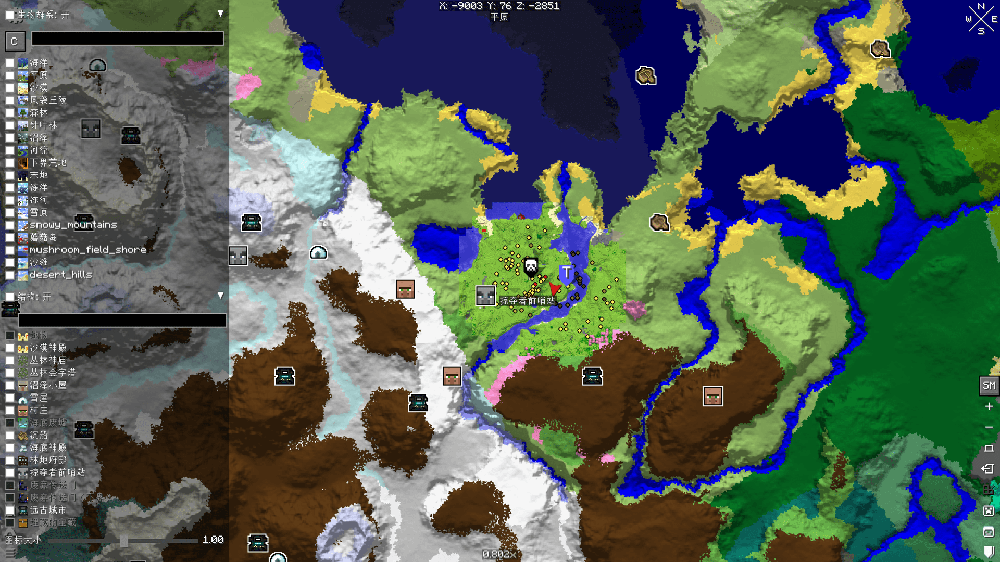

# Seed Map For Xaero

> [English](README.en.md) | **中文**

> **与 xaero96 无关，亦未获其认可。需要 Xaero's World Map。**

[](https://github.com/MineYuanlu/SeedMapForXaero/actions/workflows/matrix-test.yml)
[](https://github.com/MineYuanlu/SeedMapForXaero/releases)

在 Xaero's World Map 上显示基于种子的生物群系和结构预览，由 cubiomes 原生库驱动。

---

<div align="center">
   
</div>

## 使用方法

### 这是什么？

本模组会自动用世界种子生成的生物群系和地形数据，填充 Xaero 地图上**尚未探索**的区域。你不再需要对着地图边缘的黑色虚空发呆——而是看到预测的生物群系、地形高度和光照，仿佛你亲自去过那里。

### 能做什么？

- **快速定位生物群系** — 一眼看到沙漠、沼泽、樱花林在哪里，不用盲目乱跑
- **规划探索路线** — 出门前先看看地形，找到山脉、海洋、河流
- **配合种子高效探索** — 基于种子的预览让你知道该往哪走

### 功能一览

- 与 Xaero 地图无缝集成的多级缩放生物群系预览
- 地形高度渲染 + 光照阴影（仅主世界）
- 三级探索检测——已探索区域保留真实数据，仅填充未探索缺口
- 三种配色方案：Native（默认）、Vanilla（原版风格）、Legacy（旧风格），可在侧面板切换
- **结构图标显示** — 26 种结构类型，可在侧面板逐类开关
- **设置面板** — 地图右侧 SM 按钮，支持按生物群系/结构类型单独开关、图标大小滑条
- 种子历史记录（最多 1000 条）
- 多人模式支持——每个服务器独立存储种子和设置
- 纯客户端模组，服务端无需安装

### 操作说明

1. 安装依赖：Xaero's World Map、Fabric API
2. 按 `M` 打开大地图
3. **单机游戏**：种子自动读取，地图直接显示
4. **多人游戏**：在切换世界界面（`GuiMapSwitching`）输入种子
5. 点击右侧的 **SM** 按钮打开**设置面板**，可：
   - 按生物群系类型逐类开关（显示/隐藏特定群系）
   - 按结构类型逐类开关（显示/隐藏特定结构）
   - 调节结构图标大小（0.05~2.0 倍）

### 前置依赖

CI 矩阵验证的支持版本（`versions.json`，4 个 MC × 新旧 Xaero 各组合）：

| 依赖              | 版本                                    |
| ----------------- | --------------------------------------- |
| Minecraft         | 26.1 / 26.1.1 / 26.1.2 / 26.2           |
| Fabric Loader     | 最新                                    |
| Fabric API        | 0.155.2+（26.1）/ 0.156.0+（26.2）      |
| Xaero's World Map | 1.40.14+（26.1）/ 1.41.0+（26.2）       |
| Java              | **25**（FFM API 必需）                  |

默认构建目标：Minecraft 26.1.2 + Xaero's World Map 1.41.0 + Fabric API 0.153.0（见 `gradle.properties`）。

---

## 开发者

### 架构

Fabric 模组，通过 Mixin 注入 Xaero World Map 的渲染管线，利用 cubiomes 原生库快速生成生物群系和地形高度数据，并以叠加纹理方式渲染到地图上。

#### 核心组件

- **C 原生层** (`src/main/c/xsm/apis/render.cpp`) — 基于 cubiomes 的生物群系/结构/地形生成与光照，编译为 `libxsmcore.so`（Linux）/ `xsmcore.dll`（Windows）/ `libxsmcore.dylib`（macOS）
- **Java FFM 绑定** (`src/client/.../nativeapi/Xsm.java`) — 通过 jextract 生成的 FFM 接口调用 C 侧函数
- **缓存系统** (`CellCache` + `StructureCache` + `QueryPointCache`) — 多级缩放（1, 4, 16, 64, 256）的 GPU 纹理缓存 + 结构查询缓存，异步生成
- **侧面板** (`SeedMapPanel`) — SM 按钮打开的设置面板，支持逐生物群系/结构类型开关、图标大小滑条
- **7 个 Mixin** — `SeedMapMixin`（渲染）、`SeedMapCursorMixin`（光标信息）、`SeedMapToggleMixin`（开关）、`XsmMainPanelMixin`（侧面板）、`WorldSwitchMixin`（世界切换）、`GuiMapSwitchingMixin`（种子输入）、`StructureOverlayMixin`（结构图标）

#### 渲染流程

1. 在 Xaero 的 `GuiMap.extractRenderState` 第二次 draw 后注入
2. 根据 `userScale` 选择 cell 缩放层级（1, 4, 16, 64, 256）
3. 遍历视口内可见的 Xaero `LeveledRegion`
4. 对无 Xaero 数据的区域：直接全 cell 填充种子数据
5. 对有 Xaero 数据的区域：三级决策树检测探索状态，仅填缝未探索子块
6. SuperScale（×4）降级 + SubScale（÷4）叠加策略

#### 探索检测（三级决策树）

对每个 16×16 子块依次判断：

1. **L1**: 叶子级 `MapRegion` — `hasHadTerrain() == false` 确认未探索
2. **L2**: `MapTileChunk` — `hasHadTerrain() == false` 确认未探索
3. **L3**: `RegionTexture.getHeight() != 32767` 表示已探索

`region == null` 或 `chunk == null` 不代表未探索，必须降级到 L3 通过 `getHeight()` 终审。

### 构建

#### 前置要求

- Java 25
- git submodule（cubiomes）

#### 命令

```bash
git submodule update --init
./gradlew build -x compileNativeWindows   # Linux .so + JAR
./gradlew runClient                       # 启动 Minecraft
```

可选参数：

| 参数                          | 作用                    |
| ----------------------------- | ----------------------- |
| `-PjextractPath=/path/to/ext` | 使用本地 jextract 拷贝  |
| `-PskipNativeBuild`           | 跳过原生编译（仅 Java） |
| `-PskipNativeWindows`         | 跳过 Windows 交叉编译   |

`gradle.local.properties`（gitignored）可用于持久化本地属性覆盖。

#### C 单元测试

```bash
cmake -S src/main/c -B build-test -DCMAKE_BUILD_TYPE=Release
cmake --build build-test --target xsmtest
./build-test/xsmtest
```

加 `-DDEBUG_TIMINGS=ON` 开启性能计时。

### CI/CD

`.github/workflows/` 下四个 workflow：

| 工作流                 | 触发方式          | 行为                                                        |
| ---------------------- | ----------------- | ----------------------------------------------------------- |
| `build.yml`            | 推送 / PR         | 非 master：Linux 构建；master/tag：三平台原生编译 + 打包    |
| `matrix-test.yml`      | 推送 / 手动       | 8 组合版本矩阵（4 个 MC × 新旧 Xaero）+ 客户端 E2E GameTest |
| `refresh-versions.yml` | 每周一 + 手动     | 刷新 `versions.json` 版本矩阵（有变更才提交）               |
| `release.yml`          | workflow_dispatch | 版本提升 + 三平台编译 + Modrinth + Release                  |

Modrinth project ID: `UoJSF4vW`

测试三层（详见 `doc/testing.md`）：JVM 单测 → native 集成 → E2E 客户端 GameTest。

### 配色方案

内置三种配色方案，可通过侧面板设置切换：

- **Native**（默认） — C 侧原生生物群系颜色表
- **Vanilla** — Minecraft 原版颜色
- **Legacy** — 旧风格配色

### 国际化

界面文本支持中英文。`src/main/resources/assets/seed-map-for-xaero/lang/`：

- `en_us.json` — 英文
- `zh_cn.json` — 中文

### 技术栈

| 组件              | 说明                                                                                                            |
| ----------------- | --------------------------------------------------------------------------------------------------------------- |
| Minecraft         | 26.1.2（默认，无混淆映射）                                                                                       |
| Fabric Loom       | 1.17                                                                                                            |
| Fabric API        | 0.153.0+26.1.2（默认）                                                                                          |
| Xaero's World Map | 1.41.0（默认）                                                                                                  |
| cubiomes          | Git submodule（C 原生库），[Cubitect](https://github.com/Cubitect) 原作，[xpple](https://github.com/xpple) 维护 |
| Java              | 25（FFM API）                                                                                                   |
| 构建工具          | Gradle + CMake                                                                                                  |

---

## 致谢

- **[cubiomes](https://github.com/xpple/cubiomes)** — 核心生物群系/结构/地形生成引擎。感谢原作者 [Cubitect](https://github.com/Cubitect) 创建这一出色的库，以及 [xpple](https://github.com/xpple) 的持续维护与增强。
- **[Xaero's World Map](https://modrinth.com/mod/xaeros-world-map)** — 本模组作为其附属运行。感谢 xaero96 开发了极佳的地图模组。
- **[zh.minecraft.wiki](https://zh.minecraft.wiki)** — 提供了 Minecraft 图标与本地化翻译。采用 [CC BY-NC-SA 3.0](https://creativecommons.org/licenses/by-nc-sa/3.0/) 协议授权。

## 许可证

MIT License © 2026 yuanlu (yuanlu.bid)
