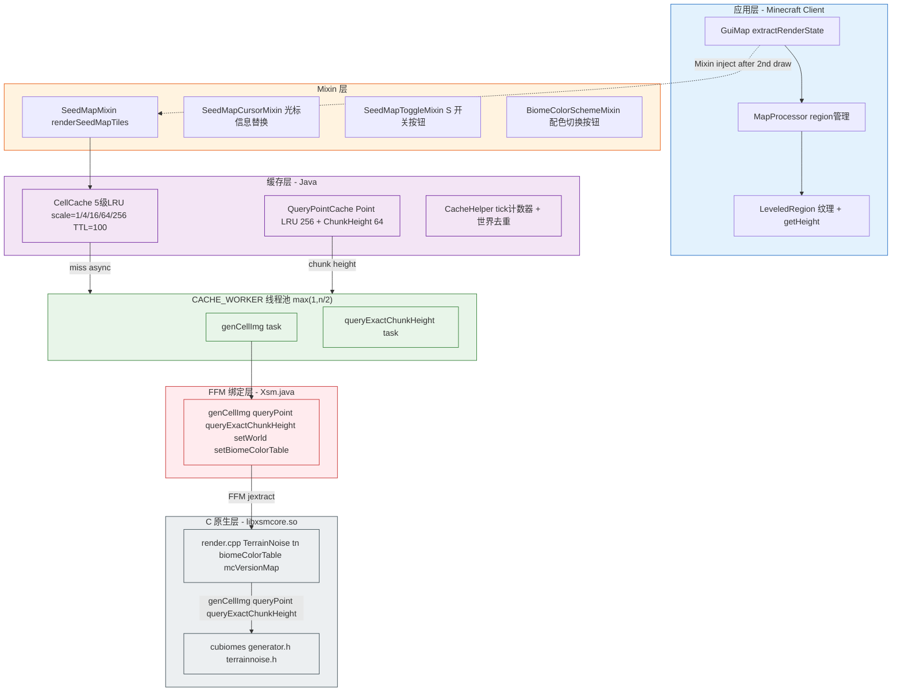
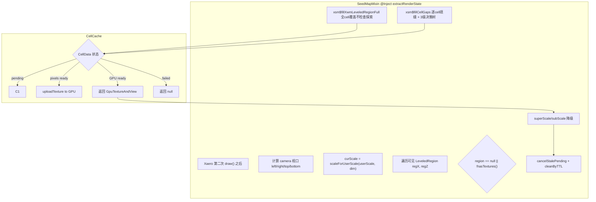
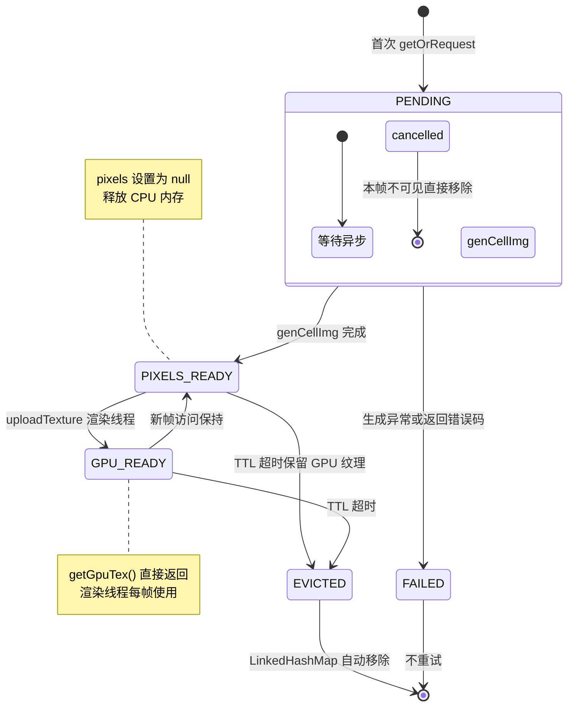
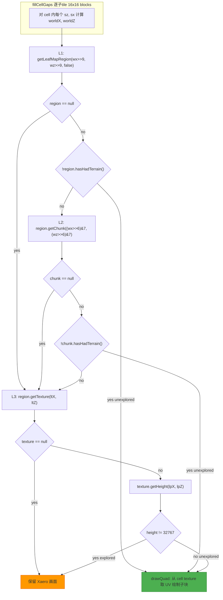
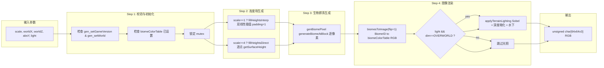
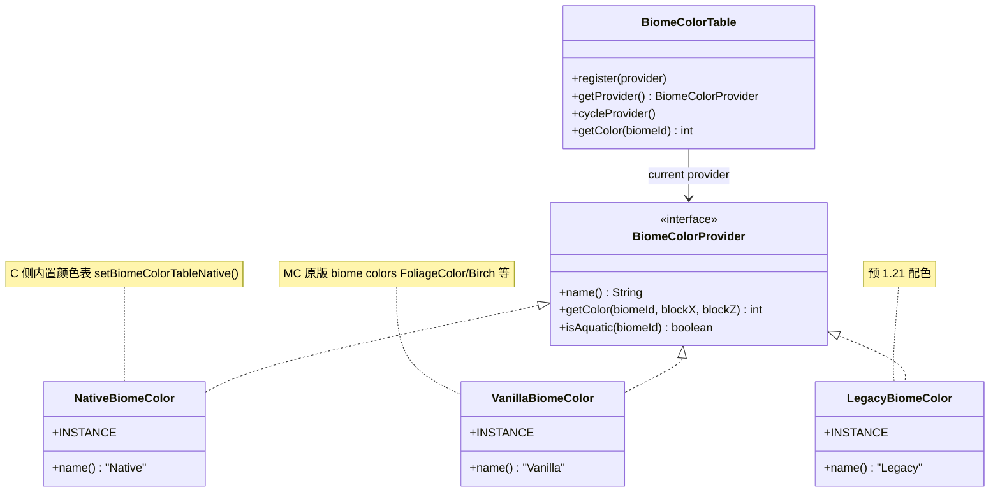
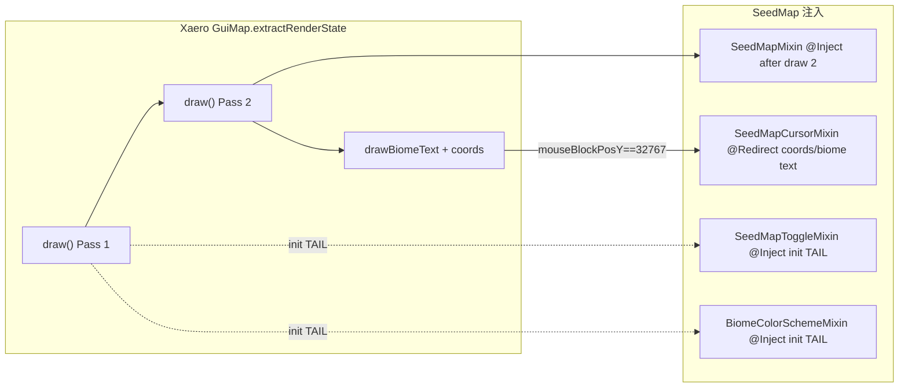

# Xaero Seed Map — 架构文档

## 整体架构



## 模块说明

| Mixin | 目标 | 功能 |
|---|---|---|
| `SeedMapMixin` | `GuiMap.extractRenderState` | 在 Xaero 第二次 `draw()` 后注入种子地图叠加渲染 |
| `SeedMapCursorMixin` | `GuiMap.extractRenderState` | 接管未探索区域的坐标与生物群系文本显示 |
| `SeedMapToggleMixin` | `GuiMap` | 添加 "S" 开关按钮，控制种子地图显隐 |
| `BiomeColorSchemeMixin` | `GuiMap` | 添加配色切换按钮，3种配色循环 |

### 2. 缓存层

- **CellCache**: 5 个独立按缩放层级 (1/4/16/64/256) 的 `LinkedHashMap`，每条目包含 `int[] pixels`（CPU 侧）+ `GpuTextureAndView`（GPU 侧）。TTL=100 ticks，超时自动淘汰。
- **QueryPointCache**: 两个 LRU cache —— `PointCache` 256 条目缓存 `queryPoint` 结果；`ChunkHeightCache` 64 条目缓存 `queryExactChunkHeight` 粒度的 16×16 高度场。高度查询优先取 chunk 精确高度，回退到近似 `NP_DEPTH` 值。
- **CacheHelper**: 全局 tick 计数器 + `CACHE_WORKER` 固定线程池（`max(1, n/2)` 线程）。世界变更时清空所有缓存。

### 3. 原生层 (C)

`render.cpp` 维护全局单例 `TerrainNoise`（内嵌 `Generator` + `BiomeNoise`），所有 API 通过 mutex 保护并发访问。

- `setGameVersion(v)` — 查询 `mcVersionMap` 初始化 `TerrainNoise`
- `setWorld(seed, dim)` — 初始化噪声生成器
- `genCellImg(scale, x, z, absY, data, light)` — 核心渲染：批量生成 64×64 像素
- `queryPoint(x, z, biomeName, height)` — 单个点的生物群系+近似高度
- `queryExactChunkHeight(cx, cz, heightsOut)` — 16×16 精确地表高度

## 渲染流程



### 缩放层级映射

```java
userScale >= 0.5       -> scale=1      // 1px = 1 block,  cell = 64x64 blocks
userScale >= 0.125     -> scale=4      // 1px = 4 blocks, cell = 256x256 blocks
userScale >= 0.03125   -> scale=16     // 1px = 16 blocks, cell = 1024x1024 blocks
userScale >= 0.0078125 -> scale=64     // 1px = 64 blocks, cell = 4096x4096 blocks
else & dim==0          -> scale=256    // 1px = 256 blocks, cell = 16384x16384 blocks
else                   -> scale=64
```

### 视口可见 Tile 计算

```java
int cellX = Math.floorDiv(worldX, 64 * scale);   // floorDiv 保证负坐标正确
int cellZ = Math.floorDiv(worldZ, 64 * scale);
```

每 cell 覆盖 `64*scale` 个方块，GPU 纹理固定 64×64 像素。

## CellData 生命周期



### TTL 驱逐策略

`CellTTLCache` 继承 `LinkedHashMap(accessOrder=true)`，每次 `getOrRequest` 更新 `lastAccessTick`。`cleanByTTL()` 每帧在 `computeIfAbsent` 之前调用，遍历并移除 `currentTick - lastAccessTick > 100` 的条目。

### Pending 取消

`cancelStalePending()` 遍历所有条目，移除 `lastPrimaryTick != currentTick && isPending()` 的条目（本帧未被访问且尚未完成的生成任务），并设置 `cancelled=true` 标记防止后台线程继续处理。

## 探索检测（三级决策树）



### 关键原则

| 条件 | 含义 | 行为 |
|---|---|---|
| `region == null` | 叶子 region 未加载 | **不能**认为未探索 -> 降级 L3 |
| `region != null && !hasHadTerrain()` | 确认无数据 | **安全**跳过（L2 免查） |
| `chunk == null` | chunk 被 Xaero 卸载 | **不能**认为未探索 -> 降级 L3 |
| `chunk != null && !hasHadTerrain()` | 确认无数据 | **安全**跳过 |
| `getHeight() == 32767` | Xaero 哨兵值 = 无数据 | 未探索 |
| `getHeight() != 32767` | 有地形数据 | 已探索 |

### 扫描线合并

连续未探索子 tile 水平合并为单个 `drawQuad`。完全未探索 cell 只需 64 次 drawQuad（每行 1 次），而非 4096 次，大幅缓解顶点提交瓶颈。

典型性能数据（0.063x zoom, scale=16）：

| 优化阶段 | fillGaps 耗时 | drawQuad 调用 |
|---|---|---|
| 原始 | ~184ms | ~10M |
| + region/chunk 预检 | ~60-80ms | ~10M |
| + 扫描线合并 | ~8ms | ~160K |

## genCellImg C 侧流水线



### 光照参数（render.cpp 调优旋钮）

```cpp
static const float XSM_SHADE_FACTOR   = 0.50f;  // 坡度影响强度
static const float XSM_MIN_LIGHT      = 0.60f;  // 最低亮度 multiplier
static const float XSM_MAX_LIGHT      = 1.40f;  // 最高亮度 multiplier
static const float XSM_DEPTH_MIN      = 0.85f;  // y=0 处深度暗化
static const float XSM_AQUA_RED_GREEN = 0.85f;  // 水下红/绿衰减
static const float XSM_AQUA_BLUE      = 0.90f;  // 水下蓝衰减
```

Sobel 坡面着色 + 深度暗化系数 + 水下染色。仅主世界启用，下界/末地跳过光照阶段。

## 配色方案



- 默认 `Native`，通过 `BiomeColorSchemeMixin` 右按钮 `cycleProvider()`
- 切换时调用 `Xsm.setBiomeColorTable(BiomeColorTable.getProvider())` + `CellCache.clear()`
- `NativeBiomeColor` 直接调 `setBiomeColorTableNative()`，C 侧用硬编码 `initBiomeColors`
- 其余 Provider 将 (biomeID, color) 对通过 FFM 传入 C 侧 `setBiomeColorTable`

## 文件树

```
src/
+-- main/
|   +-- java/bid/yuanlu/xaeroseedmap/
|   |   +-- XaeroSeedMap.java                   # ModInitializer（空壳 + id() 工具）
|   +-- resources/
|   |   +-- fabric.mod.json                     # Mod 声明
|   |   +-- xaero-seed-map.mixins.json           # 服务端 mixin config（示例占位）
|   +-- c/                                       # 原生 C 编译单元
|       +-- CMakeLists.txt                       # CMake 构建 (xsmcore + xsmtest + xsmsandbox)
|       +-- cubiomes/                            # git submodule
|       +-- mingw-toolchain.cmake                # MinGW 交叉编译
|       +-- includes.txt                         # jextract --include-function 列表
|       +-- xsm/
|       |   +-- apis/
|       |   |   +-- all.h                        # jextract 入口头文件
|       |   |   +-- api.h / api.c                # hello() 测试
|       |   |   +-- render.h                     # C API 声明
|       |   |   +-- render.cpp                   # ★ 核心实现
|       |   +-- test/
|       |   |   +-- unit_tests.cpp               # doctest 单元测试
|       |   |   +-- sandbox.cpp                  # 沙盒调试
|       |   |   +-- doctest/doctest.h
|       |   +-- utils/
|       |       +-- micro.h                      # XSM_API 宏
|       |       +-- types.h                      # 类型定义
|       |       +-- mutex.h                      # 平台互斥锁封装
|       +-- unit_test.sh                         # C 测试快捷脚本
|
+-- client/
    +-- java/bid/yuanlu/xaeroseedmap/client/
        +-- XaeroSeedMapClient.java              # 客户端入口
        +-- accessor/
        |   +-- SeedMapToggleAccessor.java       # 开关接口
        +-- cache/
        |   +-- CellCache.java                   # ★ GPU 纹理缓存（5 级缩放）
        |   +-- CacheHelper.java                 # ★ Tick + 线程池 + 世界切换
        |   +-- QueryPointCache.java             # ★ 光标查询缓存
        +-- mixin/
        |   +-- SeedMapMixin.java                # ★ 渲染注入 + 三级决策树
        |   +-- SeedMapCursorMixin.java          # 光标信息替换
        |   +-- SeedMapToggleMixin.java          # "S" 开关
        |   +-- BiomeColorSchemeMixin.java       # 配色切换
        +-- nativeapi/
        |   +-- Xsm.java                         # ★ System.load + FFM 封装
        |   +-- XsmNative.java                   # jextract 生成（gitignored）
        +-- render/
            +-- BiomeColorProvider.java          # 配色接口
            +-- BiomeColorTable.java             # 配色注册表
            +-- NativeBiomeColor.java            # C 侧原生配色
            +-- VanillaBiomeColor.java           # MC 原版配色
            +-- LegacyBiomeColor.java            # 旧版配色
```

## Mixin 注入点



## 关键注意事项

1. **`floorDiv` 必须使用`Math.floorDiv`** — 负坐标下 `(int)(x / size)` 向零取整会出错
2. **`region == null`/`chunk == null` 不等于未探索** — Xaero 可能卸载了内存但 branch 纹理有缓存
3. **`genCellImg` C侧输出 RGB** — Java 转换为 ABGR (`NativeImage.setPixelABGR` 协议)
4. **地形光照仅主世界** — 下界/末地跳过 `applyTerrainLighting`
5. **`mcVersionMap` 需更新** — 新 MC 版本需在 `render.cpp:22-60` 添加映射
6. **`setBiomeColorTable` 必须先调用** — `onInitializeClient` 中调用，否则 C 侧默认黑色
7. **`setGameVersion` -> `setWorld` -> 正常使用** — 严格顺序依赖
8. **`CacheHelper.setWorld` 去重** — 与 `Xsm.setWorld` 类似，重复调用不执行

## 数据流（一句话总结）

```
Xaero extractRenderState -> SeedMapMixin -> CellCache.getOrRequest ->
CACHE_WORKER -> Xsm.genCellImg(FFM) -> libxsmcore.so(genCellImg) ->
64x64 RGB -> Java ABGR -> uploadTexture -> GpuTextureAndView ->
fillCellGaps(三级决策树) -> drawQuad -> 屏幕
```
